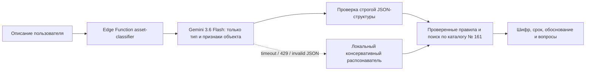

# План и архитектура: AI-распознавание объекта для сервиса шифров ОС

## Цель спринта

Исправить подбор, при котором короткий запрос вроде «мобильный телефон»
ранжировался по общему слову «связь» и приводил к сооружениям, антеннам или
линиям связи.

Новый процесс разделяет две разные задачи:

1. Gemini определяет, что это за физический объект, его основную функцию,
   исполнение, контекст, признаки комплектующей и недостающие характеристики.
2. Серверный алгоритм выбирает шифр, точное нормативное наименование и срок
   исключительно из проверенного статического каталога постановления № 161.

Gemini не получает полномочия придумывать или выбирать норму законодательства.

## Поставляемая архитектура

### Граница Gemini

Модель `google/gemini-3.6-flash` вызывается из Edge Function через встроенный
Lovable AI Gateway. В модель
передаётся только текстовое описание объекта, максимум 4 000 символов.
Файлы, история чата, профиль, права продукта и персональные данные из базы в
запрос не добавляются.

Ответ модели ограничен JSON-схемой. Разрешены только:

- нормализованное наименование и тип объекта;
- область поиска: потенциальный самостоятельный объект, комплектующая,
  потребляемый запас, услуга, не-объект или неизвестно;
- возможные разновидности;
- основная и дополнительные функции;
- контекст установки, подключение, материал;
- признак комплектующей и родительский объект;
- поисковые фразы, положительные и отрицательные маркеры;
- недостающие характеристики и уровень уверенности.

`missing_characteristics` не является списком характеристик товара вообще.
Туда попадают только признаки, которые способны изменить нормативную
позицию: назначение, самостоятельность, исполнение, контекст или подключение.
Сезонность, индексы нагрузки/скорости и профиль автомобильной шины не
разделяют позиции каталога № 161 и не задаются пользователю.

Шифр, срок, нормативное наименование и юридический вывод в схеме отсутствуют.
После ответа выполняется собственная валидация типов, обязательных полей,
длины строк, количества элементов и допустимого значения confidence.
Для этой короткой классификационной задачи OpenAI-совместимый запрос задаёт
`reasoning_effort: minimal` и резервирует до 4 096 выходных токенов. Это
оставляет место и для обязательного thinking Gemini 3.x, и для полного JSON,
не увеличивая reasoning до уровня сложной аналитической задачи. Устаревший
для Gemini 3.6 параметр `temperature` не передаётся.

### Нормативный подбор

Алгоритм сначала проверяет явно введённый пятизначный шифр, затем прямые
правила для проверенных типов объектов, затем выполняет консервативный поиск
по точным фразам и значимым словам каталога.

Для каждой позиции ответ сохраняет:

- тип совпадения;
- совпавшие признаки;
- аргументы «за» и ограничения;
- решение `recommended`, `possible` или `weak`;
- строку нормативного источника и связанные сноски.

Общие слова «оборудование», «система», «устройство», «средство» не дают
основания для уверенной рекомендации. Отрицательные признаки модели
исключают заведомо несовместимые инфраструктурные позиции.

### Fail-safe

Если ключ не настроен, Gemini недоступен, возвращает `429`, превышает таймаут
12 секунд или нарушает JSON-схему, сервис не показывает ошибку пользователю.
Включается локальный распознаватель известных объектов. Неизвестный или
неоднозначный объект получает статус уточнения либо отсутствие рекомендации,
но не случайные верхние позиции каталога.

Штатный JSON-ответ Gemini с `confidence: low` и одновременно пустыми
`normalized_name`/`object_type` означает, что объект по описанию не
идентифицирован. Такой ответ сохраняет источник `gemini`, нормализуется в
безопасный тип «неопределенный объект» и приводит к `not_found` без шифра.
Это не ошибка провайдера и не повод ошибочно помечать ответ как fallback.

Потребляемые товары, сырьё, запасы, услуги и обычные вопросы к помощнику не
передаются в ранжирование нормативного каталога. Для них возвращается
контролируемый ответ без случайных кандидатов. Комплектующие не отбрасываются:
для них поиск продолжается, но ответ отдельно предупреждает о составном
характере.

В метаданных истории фиксируются только источник распознавания
(`gemini` / `deterministic_fallback`), название модели, причина fallback и
время обработки. API-ключ и полный ответ провайдера не журналируются.

## Стоимость и эксплуатационные ограничения

Lovable AI Gateway не требует отдельного ключа Google, но его использование
не является безусловно бесплатным: запросы расходуют AI-кредиты Lovable.
Lovable указывает временный ежемесячный грант 4 AI-кредита для workspace,
после которого используются общие Cloud + AI credits. При исчерпании кредитов
gateway может вернуть `402`, при ограничении частоты — `429`.

Поэтому продукт не обещает пользователю «абсолютно бесплатно». Локальный
fallback сохраняет безопасный ответ при недоступности gateway, но production
smoke считается успешным только при фактическом ответе Gemini. Метрики
`object_identification_source` и `fallback_reason` позволяют контролировать
реальное использование.

Официальные источники:

- модель: <https://ai.google.dev/gemini-api/docs/models/gemini-3.6-flash>;
- thinking в OpenAI-совместимом API:
  <https://ai.google.dev/gemini-api/docs/openai#thinking>;
- structured output: <https://ai.google.dev/gemini-api/docs/structured-output>;
- Lovable AI и кредиты: <https://docs.lovable.dev/features/ai>.

## Изменения в продукте

- Существующий сценарий `asset_classifier` и право
  `ai_asset_classifier` сохраняются: перевыдача доступов не требуется.
- Сценарий является одноразовым инструментом. Пользователь выбирает его в
  меню возможностей, отправляет один объект, после ответа нижнее поле снова
  работает как обычный чат. Загрузка истории также не активирует
  классификатор повторно.
- UI объясняет, что ИИ распознаёт объект, но нормативный ответ берётся из
  фиксированного каталога.
- История остаётся в `ai_chat_messages`; новых таблиц и бухгалтерских фактов
  нет.
- Узкая миграция изменяет только описание существующего сценария.
- Edge Function продолжает повторно проверять продуктовый доступ пользователя.

## Управляемая конфигурация

Для production используется автоматически управляемый проектом секрет
`LOVABLE_API_KEY`; отдельный ключ Google создавать не требуется.
Значение не хранится в GitHub и не выводится в планах или логах.

Проверенный снимок постановления № 161 сохраняется в `legal_documents` и
`legal_document_versions` как опубликованный документ внутренней базы
законодательства. Пользовательские ответы не ведут на ETALON-ONLINE: каждая
найденная позиция ссылается на внутренний адрес документа и стабильный якорь
`#code-<шифр>`.

Порядок managed-релиза:

1. После merge зафиксировать точный SHA.
2. В каноническом чате Lovable выполнить PLAN-ONLY: проверить управляемый
   `LOVABLE_API_KEY` только по имени, целевой проект, миграцию и одну Edge
   Function без изменений.
3. Проверить, что документ `w21124359` отсутствует либо уже имеет тот же
   контрольный SHA-256; иное содержимое — STOP без перезаписи.
4. Синхронизировать exact SHA. Staging-документ остаётся неопубликованным.
   Маленькая managed-миграция создаёт временный закрытый буфер и выдаёт роли
   `sandbox_exec` только `SELECT, INSERT` на этот буфер. Двенадцать
   идемпотентных файлов загружают 2 349 узлов без `UPDATE` рабочих таблиц.
   Финальная managed-миграция проверяет checksum, количество и уникальность
   якорей, атомарно публикует документ, версию и текст сценария, затем удаляет
   временную схему вместе со всеми выданными на неё правами. После этого
   развернуть только `asset-classifier`.
5. Read-back: текст сценария, опубликованная внутренняя карточка постановления,
   якорь `#code-70034`, `verify_jwt=true`, версия функции и SHA.
6. Безопасный smoke под пользователем с доступом:
   - «мобильный телефон» → `70034`, 3 года;
   - «ноутбук» → `48009`, 4 года;
   - «холодильник» → вопрос о бытовом/промышленном исполнении;
   - «шина автомобильная R17» → без вопросов о сезонности, индексах и профиле;
   - «пучок петрушки свежей» → без кандидатов из оборудования;
   - «что можно сделать с тобой?» после ответа классификатора → обычный чат;
   - неизвестный объект → без случайного шифра.
7. Проверить пользователя без доступа: `403`.
8. После Publish сделать два скриншота результата и внутренней ссылки на норму
   с опубликованного URL: desktop и mobile, с привязкой к SHA и viewport.

## Приёмочные проверки

- Все 1 900 позиций каталога по-прежнему уникальны и неизменны.
- Golden-набор содержит не менее 50 формулировок известных объектов.
- «Мобильный телефон» не может вернуть `20389`, `20805`, `30037` или другую
  инфраструктурную позицию и возвращает `70034`.
- Любой шифр ответа существует в каталоге; срок и наименование совпадают с
  этой записью.
- Невалидный JSON, `429` и отсутствие ключа покрыты тестами fallback.
- Существующие доступы по продуктам, документы, платежи, контакты, проводки и
  остальные AI-сценарии не изменяются.
